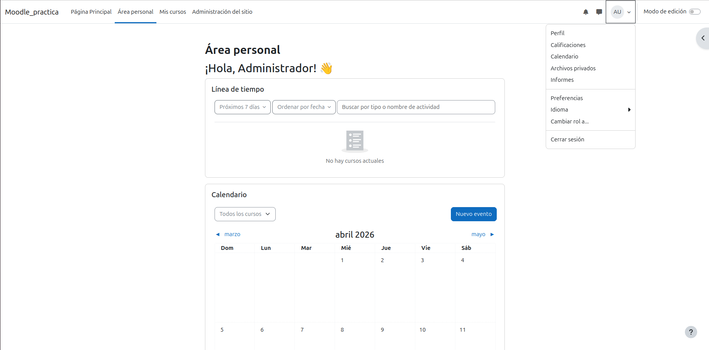
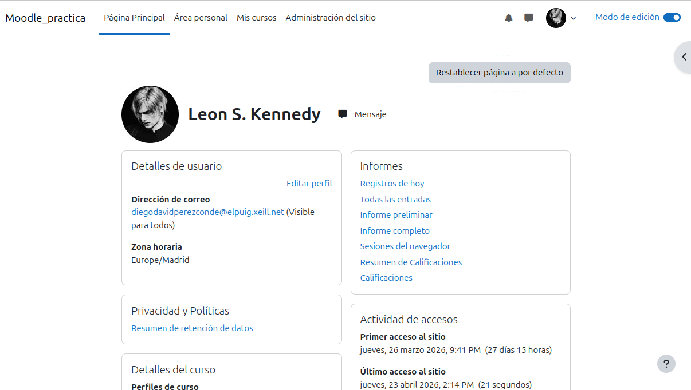
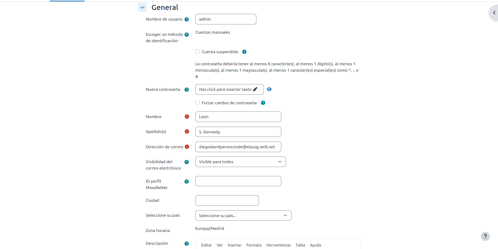
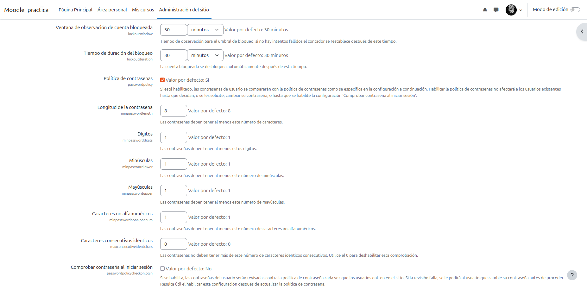
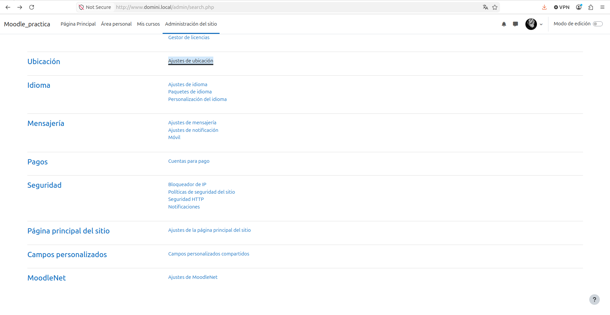
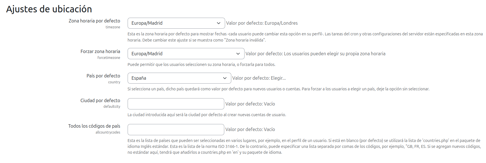
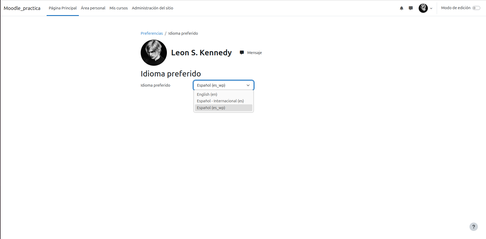
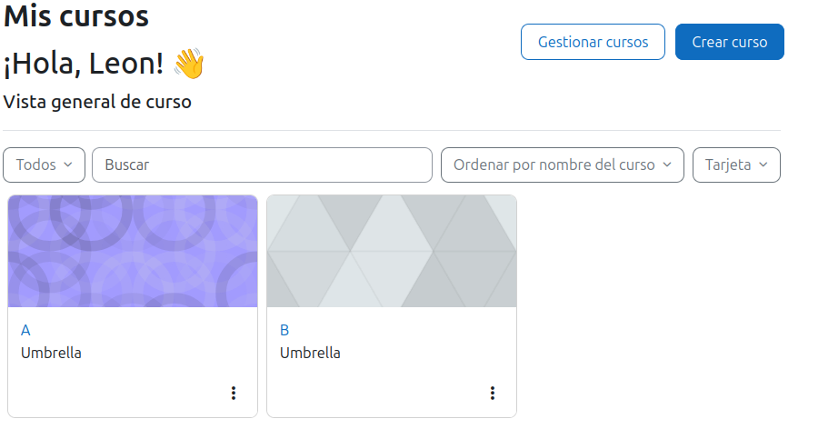
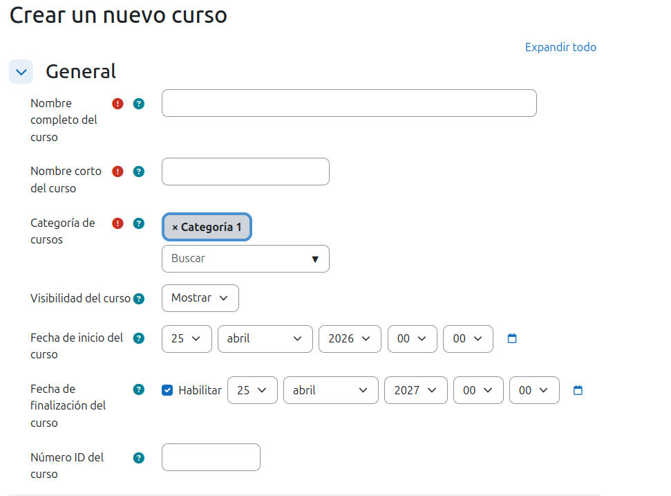

# Practica-Tema 4 Instalacion y configuracion de Moodle Diego-Perez
En esta práctica crearé un portal de Moodle como administrador, creando usuarios, cursos, temas y demás cosas que se verán en esta documentación de la práctica.

1. Configuració de l'usuari:
Para configurar tu usuario, ve al «Área personal», haz clic sobre tu foto de perfil y selecciona la opción «Perfil».

Aquí nos saldrá información de nuestro perfil, pero para poder configurarlo tendremos que ir a donde pone "Editar perfil".

En este lugar podremos configurar algunas cosas como son: el correo electrónico, el nombre que les sale a los demás usuarios, contraseñas... etc.

2. Configuración del sitio:

2.1 Configuración de la ubicación:
Para poder configurar la ubicación tendremos que ir primeramente desde el menú a "Administración del sitio" y a "Ubicación".

Finalmente, configuramos los ajustes y todo lo relacionado.

2.2 Configuración del idioma:
Para configurar el idioma nos tendremos que ir a preferencias > Idioma preferido y ahí seleccionar el idioma.

En caso de querer cambiar el idioma y que no esté disponible, simplemente ve a Administración del sitio > Paquetes de idioma y seleccionar el tuyo.

# Crear un curso

Para hacer este paso, iremos a Mis Cursos > Crear curso.

Después de esto simplemente rellenamos los campos obligatorios y opcionales si así lo deseamos.

Cuando hayamos acabado, le damos click a Guardar Cambios.

A partir d’aquí, Moodle ens portarà automàticament a la pàgina principal del curs, on podrem començar a afegir seccions, activitats i recursos.
